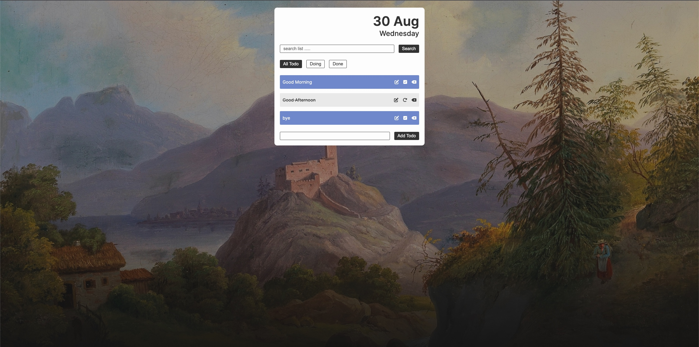

# Todo List Project Convention Guide

## Table of Contents

- [Overview](#overview)
- [Technologies Used](#technologies-used)
- [General](#general)
- [Project Structure](#project-structure)
- [Naming Convention](#naming-convention)
- [Annotation Rule](#annotation-rule)
- [HTML Semantic](#html-semantic)

## Overview

This is a simple Todo List Project that I have built by myself.It has many functionalities like : `reder-list` , `delete-list` ,`update-list` , `search` and `insert-list`

## Technologies Used

- React
- Css
- Javascript
- JSX (Javascript XML)
- Git and GitHub
- Git-Flow

## General

- `index.css` must be in the `main.jsx` becuase it has the reset styles , colors and more.

Example :

```javascript
import "./css/index.css";
import App from "./App.jsx";
```

- Colors :

  - light-black-bg : `#393939`
  - bg-color : `#fcc8b5`
  - white-color : `#fdfdfd`
  - bg-list-done : `#ececec`
  - even-list-bg : `#ffaab4`
  - odd-list-bg : `#7891d3`

- Font :

  - root-font-size : `62.5%` and `1rem = 10px`
  - Font Family : `"Inter", sans-serif` [Link](https://fonts.google.com/specimen/Inter?query=in)
  - Font Weight : `200`,`400`,`500` and `600`
  - Big-Title Size : `4.8rem` with `600` font-weight
  - Small-Title Size : `2.6rem` with `500` font-weight
  - Normal-Text Size : `1.6rem` with `400` font-weight
  - Xs-Text Size : `1.2rem` with `200` font-weight
  - Line-Height : `default`

- Icons :

  - FontAwesome : [Link](https://fontawesome.com/)

- No inline css

- Width
  - width-todo-app : `55rem`
- Space :
  - gap : `1.6rem`
  - margin-y : `2.6rem`
- Radius

  - radius : `0.3rem`

# Project Structure

```
|--- docs/
|    |--- convention.md
|    images/
|--- public/
|
|--- src/
|    |--- components/
|    |    |--- Button/
|    |    |--- FormEdit/
|    |    |--- Input/
|    |    |--- List/
|    |    |--- Title/
|    |    |--- Todo/
|    |
|    |--- css/
|    |--- js/
|    |--- App.jsx
|    |--- main.jsx
|
|--- index.html
|--- package.json
```

- `docs` folder store the `convention.md` file about the project
- `src` folder is a place to add or write code
- `component` folder store all the small reusable components

  - such as : `Button` , `FormEdit`....
  - Inside the small component folder has 2 files : `Button.jsx` and their styles `Button.css`

  ```
  |--- Button/
  |    |--- Button.css
  |    |--- Button.jsx
  ```

# Naming Convention

- Normal Folder name : `camelCase` or `PascalCase`
  - Example : `css` or `CSS` but for normal folder `camelCase` is default
- Component Name : `PascalCase`.
  - Example : `Button.jsx` , `Button.css`
- Function Name : `camelCase`
  - Example : `upDateTask()`
- Variable Name : `camelCase`
  - Example : `let isDone = false`
- CSS Class Name : `lowercase`

  - Example : `.btn` and 2 words name use `-` => `.btn-primary`

# Annotation Rule

- Comment in Css : ` /* something */`
- Comment in Jsx : `// something`

# HTML Semantic

- Using `Semantic Tags` as posible and avoid using too much `div` tag
- Example :
  - `<section>`
  - `<main>`
  - `<ul>`

# Final

- Landing Page


